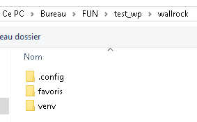

## WallRock 

WallRock est une application bureau pour trier et changer ces fonds d'écran d'ordinateur

## OS Vérifiés ✅ ❌

> Windows 
> - 10 ✅
>
> Mac OS 
> - Sonoma 14.4.1 ✅
> 
> Linux 
> - Ubuntu ?

## Utilisation

<!-- ### Lancement de l'application -->
<!-- Cliquer deux fois sur le fichier **wallrock** dans le dossier **dist** -->

Une fois l'application lancée, choisissez le dossier dans lequel vous avez téléchargé ce projet



### Fonctionnalités

- Changer le fond d'écran
- Parcourir les dossiers
- Revenir dans le dossier précédent en cliquant sur la flèche : 
- Glisser une image dans un dossier pour déplacer l'image dans le dossier en question
- Glisser une image sur la fleche  pour déplacer l'image dans le dossier précédent
- Ajouter une image au dossier en cours

### Fonctionnalités futur
- Créer un dossier
- Supprimer une image

## Accès au code
### Installation
```
python3 -m venv venv
source venv/bin/activate (ou venv/Scripts/activate si windows )
pip install -r requirements.txt
```
### Lancement
```
python3 wallrock.py
```
<!-- ### Créer un nouveau fichier exécutable
Dans l'environnement virtuel faire:
```
pyinstaller --onefile wallrock.py
``` -->
